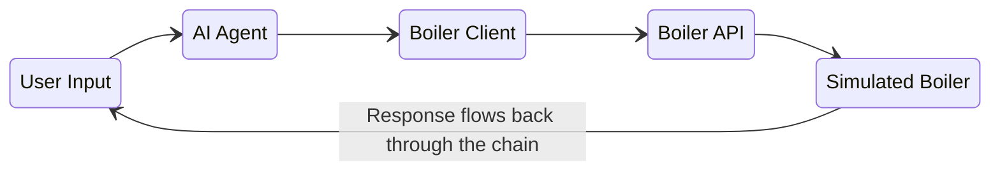

# Boiler Control AI Agent Demo

This repository contains a demonstration project showing how to build an AI Agent that controls a smart boiler system. The project showcases the integration of a Large Language Model (LLM) with a simulated IoT device through a REST API.

## Project Components

- `boiler_api/`: Contains the simulated boiler API and client
  - `boiler_api.py`: A Flask-based REST API simulating a smart boiler
  - `boiler_client.py`: Python client for interacting with the boiler API
- `boiler_agent.py`: The AI agent implementation using Ollama and the Mistral model

## Prerequisites

- Python 3.8+
- [Ollama](https://ollama.com/) installed with the mistral-nemo model
- Flask and Requests libraries

## Installation

1. Clone the repository:
```bash
git clone https://github.com/tcsizmadia/llm-tooling-sandbox.git
cd llm-tooling-sandbox
```

2. Install dependencies:
```bash
cd boiler_api
python -m pip install -r requirements.txt
```

3. Make sure Ollama is running with the mistral-nemo model:
```bash
ollama run mistral-nemo
```

## Usage

1. Start the boiler API (in one terminal):
```bash
python boiler_api/boiler_api.py
```

2. Run the AI agent (in another terminal):
```bash
python boiler_agent.py
```

3. Interact with the agent using natural language. Example commands:
   - "What's the current temperature?"
   - "I feel cold, can you increase the temperature?"
   - "Is the boiler heating right now?"
   - "Set the temperature to 23 degrees"

## Features

- Simulated smart boiler with temperature control
- REST API for boiler interaction
- Natural language interface using LLM
- Temperature adjustment simulation
- Error state monitoring

## Architecture



## License

MIT License

## Blog Post

For a detailed explanation, check out my blog post: [Building Your First AI Agent](https://2ndworst.dev/posts/building-your-first-ai-agent)